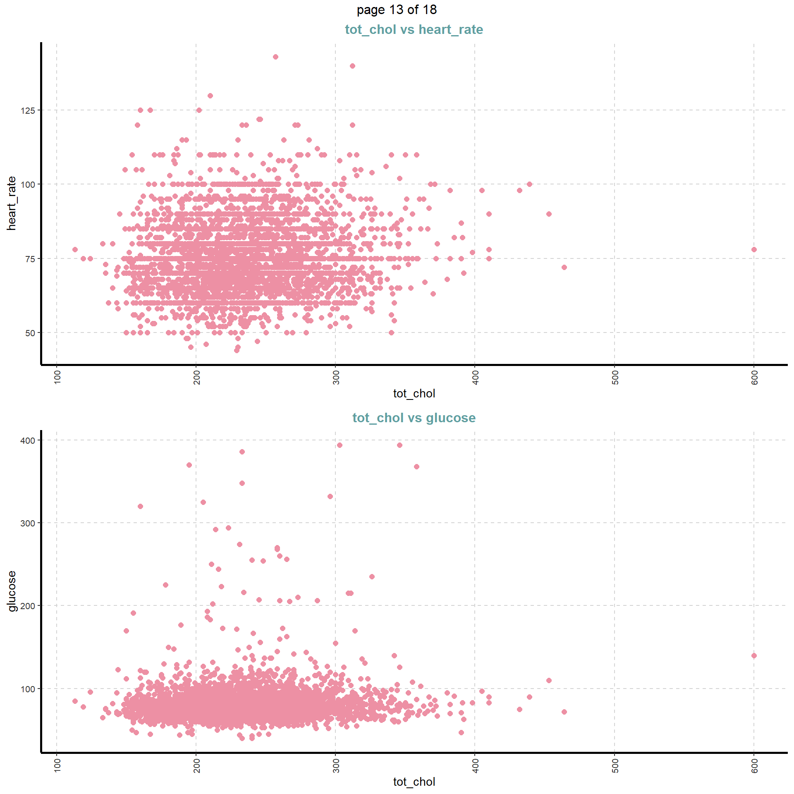

```{r setup, include=FALSE}
knitr::opts_chunk$set(echo = TRUE)
library(MASS)
library(ISLR)
library(tidyverse)
library(pROC)
library(rpart)
library(rpart.plot)
library(e1071) 
library(caTools) 
library(class)
library(SmartEDA)
library(caret)
library(janitor)
library(mlbench)
library(tree)
library(glmnet)
library(mlr)
library(parallelMap)
library(parallel)
library(knitr)
library(randomForest)
```

## Data set

The chosen data set is the Firmingham Heart Study dataset. It can be found at the following URL: <https://www.kaggle.com/amanajmera1/framingham-heart-study-dataset>. This data set contains 15 numeric predictor variables and 1 factor response variable (TenYearCHD). This response variable indicates whether or not a person has developed CHD (Coronary Heart Disease) within the duration of the study period (10 years).

The predictor variables pertain to the demographic characteristics of the study's participants (sex, education, smoker) and his or her medical details (medication, stroke prevalence, diabetes, etc.). The dataset contains 3658 records of patients that were involved in the study so it can be stated that the data collection was extensive.

```{r, fh, eval=FALSE}
fh = read_csv("data/framingham.csv")

fh <- fh %>%
  clean_names() %>%
  na.omit()

fh$ten_year_chd <- as.factor(fh$ten_year_chd)
```

## Performing Exploratory Data Analysis

For this part of the assignment, EDA is performed to gain a basic understanding of the data so that it can guide further analyses.
The data is viewed, an overview is generated to look at the variables contained in the data set, and the structure of the data set is checked. Lastly, the response variable is identified and its balance is checked (i.e. to see if it is unbalanced).

```{r, eval=FALSE}
View(fh)
head(fh)
tail(fh)
anyNA(fh) # Check NAs in dataset
ExpData(fh, type=1) # Check overview of data - No NAs, all numeric variables
ExpData(fh, type=2) # Check structure of data
table(fh$ten_year_chd) # Check balance of response variable (Note: very unbalanced)
```
The response variable is identified as "ten_year_chd". This response variable indicates whether or not a person has developed CHD (Coronary Heart Disease) within the duration of the study period (10 years). Furthermore, the predictor variables are all numeric. And the data does not contain NAs anymore.

Below you can see some highlights of the EDA. A link will be provided to full generated report of the EDA at the end of this section.


<div class="pagedtable pagedtable-not-empty" style="opacity: 1;"><table style="visibility: hidden; position: absolute; white-space: nowrap; height: auto; width: auto;"><tr><td>ABCDEFGHIJ0123456789</td></tr></table><table cellspacing="0" class="table table-condensed"><thead><tr><th align="left" style="text-align: left; max-width: 459px; min-width: 459px;"><div class="pagedtable-header-name">Descriptions</div><div class="pagedtable-header-type">&lt;chr&gt;</div></th><th align="left" style="text-align: left; max-width: 81px; min-width: 81px;"><div class="pagedtable-header-name">Value</div><div class="pagedtable-header-type">&lt;chr&gt;</div></th><th class="pagedtable-padding-col"></th><th class="pagedtable-padding-col"></th><th class="pagedtable-padding-col"></th></tr></thead><tbody><tr class="odd"><td align="left" style="text-align: left; max-width: 459px; min-width: 459px;">Sample size (nrow)</td><td align="left" style="text-align: left; max-width: 81px; min-width: 81px;">3658</td><td class="pagedtable-padding-col"></td><td class="pagedtable-padding-col"></td><td class="pagedtable-padding-col"></td></tr><tr class="even"><td align="left" style="text-align: left; max-width: 459px; min-width: 459px;">No. of variables (ncol)</td><td align="left" style="text-align: left; max-width: 81px; min-width: 81px;">16</td><td class="pagedtable-padding-col"></td><td class="pagedtable-padding-col"></td><td class="pagedtable-padding-col"></td></tr><tr class="odd"><td align="left" style="text-align: left; max-width: 459px; min-width: 459px;">No. of numeric/interger variables</td><td align="left" style="text-align: left; max-width: 81px; min-width: 81px;">15</td><td class="pagedtable-padding-col"></td><td class="pagedtable-padding-col"></td><td class="pagedtable-padding-col"></td></tr><tr class="even"><td align="left" style="text-align: left; max-width: 459px; min-width: 459px;">No. of factor variables</td><td align="left" style="text-align: left; max-width: 81px; min-width: 81px;">1</td><td class="pagedtable-padding-col"></td><td class="pagedtable-padding-col"></td><td class="pagedtable-padding-col"></td></tr><tr class="odd"><td align="left" style="text-align: left; max-width: 459px; min-width: 459px;">No. of text variables</td><td align="left" style="text-align: left; max-width: 81px; min-width: 81px;">0</td><td class="pagedtable-padding-col"></td><td class="pagedtable-padding-col"></td><td class="pagedtable-padding-col"></td></tr><tr class="even"><td align="left" style="text-align: left; max-width: 459px; min-width: 459px;">No. of logical variables</td><td align="left" style="text-align: left; max-width: 81px; min-width: 81px;">0</td><td class="pagedtable-padding-col"></td><td class="pagedtable-padding-col"></td><td class="pagedtable-padding-col"></td></tr><tr class="odd"><td align="left" style="text-align: left; max-width: 459px; min-width: 459px;">No. of identifier variables</td><td align="left" style="text-align: left; max-width: 81px; min-width: 81px;">0</td><td class="pagedtable-padding-col"></td><td class="pagedtable-padding-col"></td><td class="pagedtable-padding-col"></td></tr><tr class="even"><td align="left" style="text-align: left; max-width: 459px; min-width: 459px;">No. of date variables</td><td align="left" style="text-align: left; max-width: 81px; min-width: 81px;">0</td><td class="pagedtable-padding-col"></td><td class="pagedtable-padding-col"></td><td class="pagedtable-padding-col"></td></tr><tr class="odd"><td align="left" style="text-align: left; max-width: 459px; min-width: 459px;">No. of zero variance variables (uniform)</td><td align="left" style="text-align: left; max-width: 81px; min-width: 81px;">0</td><td class="pagedtable-padding-col"></td><td class="pagedtable-padding-col"></td><td class="pagedtable-padding-col"></td></tr><tr class="even"><td align="left" style="text-align: left; max-width: 459px; min-width: 459px;">%. of variables having complete cases</td><td align="left" style="text-align: left; max-width: 81px; min-width: 81px;">100% (16)</td><td class="pagedtable-padding-col"></td><td class="pagedtable-padding-col"></td><td class="pagedtable-padding-col"></td></tr></tbody></table><div class="pagedtable-footer"><a class="pagedtable-index-nav">Next</a><div class="pagedtable-indexes"><a class="pagedtable-index pagedtable-index-current" data-page-index="0">1</a><a class="pagedtable-index" data-page-index="1">2</a></div><a class="pagedtable-index-nav pagedtable-index-nav-disabled">Previous</a><div class="pagedtable-info" title="1-10 of 13 rows">1-10 of 13 rows</div></div></div>


<div data-pagedtable="true" pagedtable-page="0" class="pagedtable-wrapper">
<script data-pagedtable-source="" type="application/json">
{"columns":[{"label":["Index"],"name":[1],"type":["dbl"],"align":["right"]},{"label":["Variable_Name"],"name":[2],"type":["chr"],"align":["left"]},{"label":["Variable_Type"],"name":[3],"type":["chr"],"align":["left"]},{"label":["Per_of_Missing"],"name":[4],"type":["dbl"],"align":["right"]},{"label":["No_of_distinct_values"],"name":[5],"type":["int"],"align":["right"]}],"data":[{"1":"1","2":"male","3":"numeric","4":"0","5":"2"},{"1":"2","2":"age","3":"numeric","4":"0","5":"39"},{"1":"3","2":"education","3":"numeric","4":"0","5":"4"},{"1":"4","2":"current_smoker","3":"numeric","4":"0","5":"2"},{"1":"5","2":"cigs_per_day","3":"numeric","4":"0","5":"33"},{"1":"6","2":"bp_meds","3":"numeric","4":"0","5":"2"},{"1":"7","2":"prevalent_stroke","3":"numeric","4":"0","5":"2"},{"1":"8","2":"prevalent_hyp","3":"numeric","4":"0","5":"2"},{"1":"9","2":"diabetes","3":"numeric","4":"0","5":"2"},{"1":"10","2":"tot_chol","3":"numeric","4":"0","5":"241"},{"1":"11","2":"sys_bp","3":"numeric","4":"0","5":"231"},{"1":"12","2":"dia_bp","3":"numeric","4":"0","5":"142"},{"1":"13","2":"bmi","3":"numeric","4":"0","5":"1298"},{"1":"14","2":"heart_rate","3":"numeric","4":"0","5":"72"},{"1":"15","2":"glucose","3":"numeric","4":"0","5":"138"},{"1":"16","2":"ten_year_chd","3":"factor","4":"0","5":"2"}],"options":{"columns":{"min":{},"max":[10]},"rows":{"min":[10],"max":[10]},"pages":{}}}
  </script>
<div class="pagedtable pagedtable-not-empty" style="opacity: 1;"><table style="visibility: hidden; position: absolute; white-space: nowrap; height: auto; width: auto;"><tr><td>ABCDEFGHIJ0123456789</td></tr></table><table cellspacing="0" class="table table-condensed"><thead><tr><th align="right" style="text-align: right; max-width: 45px; min-width: 45px;"><div class="pagedtable-header-name">Index</div><div class="pagedtable-header-type">&lt;dbl&gt;</div></th><th align="left" style="text-align: left; max-width: 144px; min-width: 144px;"><div class="pagedtable-header-name">Variable_Name</div><div class="pagedtable-header-type">&lt;chr&gt;</div></th><th align="left" style="text-align: left; max-width: 117px; min-width: 117px;"><div class="pagedtable-header-name">Variable_Type</div><div class="pagedtable-header-type">&lt;chr&gt;</div></th><th align="right" style="text-align: right; max-width: 126px; min-width: 126px;"><div class="pagedtable-header-name">Per_of_Missing</div><div class="pagedtable-header-type">&lt;dbl&gt;</div></th><th align="right" style="text-align: right; max-width: 189px; min-width: 189px;"><div class="pagedtable-header-name">No_of_distinct_values</div><div class="pagedtable-header-type">&lt;int&gt;</div></th></tr></thead><tbody><tr class="odd"><td align="right" style="text-align: right; max-width: 45px; min-width: 45px;">1</td><td align="left" style="text-align: left; max-width: 144px; min-width: 144px;">male</td><td align="left" style="text-align: left; max-width: 117px; min-width: 117px;">numeric</td><td align="right" style="text-align: right; max-width: 126px; min-width: 126px;">0</td><td align="right" style="text-align: right; max-width: 189px; min-width: 189px;">2</td></tr><tr class="even"><td align="right" style="text-align: right; max-width: 45px; min-width: 45px;">2</td><td align="left" style="text-align: left; max-width: 144px; min-width: 144px;">age</td><td align="left" style="text-align: left; max-width: 117px; min-width: 117px;">numeric</td><td align="right" style="text-align: right; max-width: 126px; min-width: 126px;">0</td><td align="right" style="text-align: right; max-width: 189px; min-width: 189px;">39</td></tr><tr class="odd"><td align="right" style="text-align: right; max-width: 45px; min-width: 45px;">3</td><td align="left" style="text-align: left; max-width: 144px; min-width: 144px;">education</td><td align="left" style="text-align: left; max-width: 117px; min-width: 117px;">numeric</td><td align="right" style="text-align: right; max-width: 126px; min-width: 126px;">0</td><td align="right" style="text-align: right; max-width: 189px; min-width: 189px;">4</td></tr><tr class="even"><td align="right" style="text-align: right; max-width: 45px; min-width: 45px;">4</td><td align="left" style="text-align: left; max-width: 144px; min-width: 144px;">current_smoker</td><td align="left" style="text-align: left; max-width: 117px; min-width: 117px;">numeric</td><td align="right" style="text-align: right; max-width: 126px; min-width: 126px;">0</td><td align="right" style="text-align: right; max-width: 189px; min-width: 189px;">2</td></tr><tr class="odd"><td align="right" style="text-align: right; max-width: 45px; min-width: 45px;">5</td><td align="left" style="text-align: left; max-width: 144px; min-width: 144px;">cigs_per_day</td><td align="left" style="text-align: left; max-width: 117px; min-width: 117px;">numeric</td><td align="right" style="text-align: right; max-width: 126px; min-width: 126px;">0</td><td align="right" style="text-align: right; max-width: 189px; min-width: 189px;">33</td></tr><tr class="even"><td align="right" style="text-align: right; max-width: 45px; min-width: 45px;">6</td><td align="left" style="text-align: left; max-width: 144px; min-width: 144px;">bp_meds</td><td align="left" style="text-align: left; max-width: 117px; min-width: 117px;">numeric</td><td align="right" style="text-align: right; max-width: 126px; min-width: 126px;">0</td><td align="right" style="text-align: right; max-width: 189px; min-width: 189px;">2</td></tr><tr class="odd"><td align="right" style="text-align: right; max-width: 45px; min-width: 45px;">7</td><td align="left" style="text-align: left; max-width: 144px; min-width: 144px;">prevalent_stroke</td><td align="left" style="text-align: left; max-width: 117px; min-width: 117px;">numeric</td><td align="right" style="text-align: right; max-width: 126px; min-width: 126px;">0</td><td align="right" style="text-align: right; max-width: 189px; min-width: 189px;">2</td></tr><tr class="even"><td align="right" style="text-align: right; max-width: 45px; min-width: 45px;">8</td><td align="left" style="text-align: left; max-width: 144px; min-width: 144px;">prevalent_hyp</td><td align="left" style="text-align: left; max-width: 117px; min-width: 117px;">numeric</td><td align="right" style="text-align: right; max-width: 126px; min-width: 126px;">0</td><td align="right" style="text-align: right; max-width: 189px; min-width: 189px;">2</td></tr><tr class="odd"><td align="right" style="text-align: right; max-width: 45px; min-width: 45px;">9</td><td align="left" style="text-align: left; max-width: 144px; min-width: 144px;">diabetes</td><td align="left" style="text-align: left; max-width: 117px; min-width: 117px;">numeric</td><td align="right" style="text-align: right; max-width: 126px; min-width: 126px;">0</td><td align="right" style="text-align: right; max-width: 189px; min-width: 189px;">2</td></tr><tr class="even"><td align="right" style="text-align: right; max-width: 45px; min-width: 45px;">10</td><td align="left" style="text-align: left; max-width: 144px; min-width: 144px;">tot_chol</td><td align="left" style="text-align: left; max-width: 117px; min-width: 117px;">numeric</td><td align="right" style="text-align: right; max-width: 126px; min-width: 126px;">0</td><td align="right" style="text-align: right; max-width: 189px; min-width: 189px;">241</td></tr></tbody></table><div class="pagedtable-footer"><a class="pagedtable-index-nav">Next</a><div class="pagedtable-indexes"><a class="pagedtable-index pagedtable-index-current" data-page-index="0">1</a><a class="pagedtable-index" data-page-index="1">2</a></div><a class="pagedtable-index-nav pagedtable-index-nav-disabled">Previous</a><div class="pagedtable-info" title="1-10 of 16 rows">1-10 of 16 rows</div></div></div></div>

```{r, eval=FALSE}
ExpNumStat(fh,by="A",gp=NULL,Qnt=seq(0,1,0.1),MesofShape=2,Outlier=TRUE,round=2)
```

<div data-pagedtable="true" pagedtable-page="0" class="pagedtable-wrapper">
<script data-pagedtable-source="" type="application/json">
{"columns":[{"label":["Vname"],"name":[1],"type":["chr"],"align":["left"]},{"label":["Group"],"name":[2],"type":["chr"],"align":["left"]},{"label":["TN"],"name":[3],"type":["dbl"],"align":["right"]},{"label":["nNeg"],"name":[4],"type":["dbl"],"align":["right"]},{"label":["nZero"],"name":[5],"type":["dbl"],"align":["right"]},{"label":["nPos"],"name":[6],"type":["dbl"],"align":["right"]},{"label":["NegInf"],"name":[7],"type":["dbl"],"align":["right"]},{"label":["PosInf"],"name":[8],"type":["dbl"],"align":["right"]},{"label":["NA_Value"],"name":[9],"type":["dbl"],"align":["right"]},{"label":["Per_of_Missing"],"name":[10],"type":["dbl"],"align":["right"]},{"label":["sum"],"name":[11],"type":["dbl"],"align":["right"]},{"label":["min"],"name":[12],"type":["dbl"],"align":["right"]},{"label":["max"],"name":[13],"type":["dbl"],"align":["right"]},{"label":["mean"],"name":[14],"type":["dbl"],"align":["right"]},{"label":["median"],"name":[15],"type":["dbl"],"align":["right"]},{"label":["SD"],"name":[16],"type":["dbl"],"align":["right"]},{"label":["CV"],"name":[17],"type":["dbl"],"align":["right"]},{"label":["IQR"],"name":[18],"type":["dbl"],"align":["right"]},{"label":["Skewness"],"name":[19],"type":["dbl"],"align":["right"]},{"label":["Kurtosis"],"name":[20],"type":["dbl"],"align":["right"]},{"label":["0%"],"name":[21],"type":["dbl"],"align":["right"]},{"label":["10%"],"name":[22],"type":["dbl"],"align":["right"]},{"label":["20%"],"name":[23],"type":["dbl"],"align":["right"]},{"label":["30%"],"name":[24],"type":["dbl"],"align":["right"]},{"label":["40%"],"name":[25],"type":["dbl"],"align":["right"]},{"label":["50%"],"name":[26],"type":["dbl"],"align":["right"]},{"label":["60%"],"name":[27],"type":["dbl"],"align":["right"]},{"label":["70%"],"name":[28],"type":["dbl"],"align":["right"]},{"label":["80%"],"name":[29],"type":["dbl"],"align":["right"]},{"label":["90%"],"name":[30],"type":["dbl"],"align":["right"]},{"label":["100%"],"name":[31],"type":["dbl"],"align":["right"]},{"label":["LB.25%"],"name":[32],"type":["dbl"],"align":["right"]},{"label":["UB.75%"],"name":[33],"type":["dbl"],"align":["right"]},{"label":["nOutliers"],"name":[34],"type":["dbl"],"align":["right"]}],"data":[{"1":"age","2":"All","3":"3658","4":"0","5":"0","6":"3658","7":"0","8":"0","9":"0","10":"0","11":"181261.00","12":"32.00","13":"70.0","14":"49.55","15":"49.00","16":"8.56","17":"0.17","18":"14.00","19":"0.23","20":"-0.99","21":"32.00","22":"39.00","23":"41.00","24":"44.00","25":"46.00","26":"49.00","27":"52.00","28":"55.00","29":"58.00","30":"62.00","31":"70.0","32":"21.00","33":"77.00","34":"0"},{"1":"bmi","2":"All","3":"3658","4":"0","5":"0","6":"3658","7":"0","8":"0","9":"0","10":"0","11":"94313.49","12":"15.54","13":"56.8","14":"25.78","15":"25.38","16":"4.07","17":"0.16","18":"4.96","19":"1.00","20":"2.83","21":"15.54","22":"21.08","23":"22.53","24":"23.57","25":"24.46","26":"25.38","27":"26.33","28":"27.39","29":"28.68","30":"30.63","31":"56.8","32":"15.64","33":"35.47","34":"85"},{"1":"cigs_per_day","2":"All","3":"3658","4":"0","5":"1869","6":"1789","7":"0","8":"0","9":"0","10":"0","11":"33015.00","12":"0.00","13":"70.0","14":"9.03","15":"0.00","16":"11.92","17":"1.32","18":"20.00","19":"1.23","20":"0.95","21":"0.00","22":"0.00","23":"0.00","24":"0.00","25":"0.00","26":"0.00","27":"9.00","28":"15.00","29":"20.00","30":"25.00","31":"70.0","32":"-30.00","33":"50.00","34":"10"},{"1":"dia_bp","2":"All","3":"3658","4":"0","5":"0","6":"3658","7":"0","8":"0","9":"0","10":"0","11":"303310.50","12":"48.00","13":"142.5","14":"82.92","15":"82.00","16":"11.97","17":"0.14","18":"15.00","19":"0.71","20":"1.26","21":"48.00","22":"69.00","23":"73.00","24":"76.50","25":"80.00","26":"82.00","27":"85.00","28":"87.50","29":"92.00","30":"98.00","31":"142.5","32":"52.50","33":"112.50","34":"69"},{"1":"glucose","2":"All","3":"3658","4":"0","5":"0","6":"3658","7":"0","8":"0","9":"0","10":"0","11":"299418.00","12":"40.00","13":"394.0","14":"81.85","15":"78.00","16":"23.90","17":"0.29","18":"16.00","19":"6.28","20":"60.05","21":"40.00","22":"65.00","23":"70.00","24":"73.00","25":"75.00","26":"78.00","27":"81.00","28":"85.00","29":"89.00","30":"98.00","31":"394.0","32":"47.00","33":"111.00","34":"175"},{"1":"heart_rate","2":"All","3":"3658","4":"0","5":"0","6":"3658","7":"0","8":"0","9":"0","10":"0","11":"277023.00","12":"44.00","13":"143.0","14":"75.73","15":"75.00","16":"11.98","17":"0.16","18":"14.00","19":"0.67","20":"1.06","21":"44.00","22":"60.00","23":"65.00","24":"70.00","25":"72.00","26":"75.00","27":"77.00","28":"80.00","29":"85.00","30":"91.00","31":"143.0","32":"47.00","33":"103.00","34":"80"},{"1":"sys_bp","2":"All","3":"3658","4":"0","5":"0","6":"3658","7":"0","8":"0","9":"0","10":"0","11":"484211.50","12":"83.50","13":"295.0","14":"132.37","15":"128.00","16":"22.09","17":"0.17","18":"26.88","19":"1.16","20":"2.27","21":"83.50","22":"109.00","23":"114.00","24":"119.05","25":"124.00","26":"128.00","27":"133.00","28":"140.00","29":"148.00","30":"162.00","31":"295.0","32":"76.69","33":"184.19","34":"110"},{"1":"tot_chol","2":"All","3":"3658","4":"0","5":"0","6":"3658","7":"0","8":"0","9":"0","10":"0","11":"866389.00","12":"113.00","13":"600.0","14":"236.85","15":"234.00","16":"44.10","17":"0.19","18":"57.00","19":"0.66","20":"1.84","21":"113.00","22":"183.00","23":"200.00","24":"212.00","25":"223.00","26":"234.00","27":"245.00","28":"257.00","29":"271.00","30":"293.00","31":"600.0","32":"120.50","33":"348.50","34":"46"}],"options":{"columns":{"min":{},"max":[10]},"rows":{"min":[10],"max":[10]},"pages":{}}}
  </script>
<div class="pagedtable pagedtable-not-empty" style="opacity: 1;"><table style="visibility: hidden; position: absolute; white-space: nowrap; height: auto; width: auto;"><tr><td>ABCDEFGHIJ0123456789</td></tr></table><table cellspacing="0" class="table table-condensed"><thead><tr style="opacity: 1; transform: translateX(0px); transition: transform 200ms linear 0s, opacity 200ms ease 0s;"><th align="left" style="text-align: left; max-width: 108px; min-width: 108px;"><div class="pagedtable-header-name">Vname</div><div class="pagedtable-header-type">&lt;chr&gt;</div></th><th align="left" style="text-align: left; max-width: 45px; min-width: 45px;"><div class="pagedtable-header-name">Group</div><div class="pagedtable-header-type">&lt;chr&gt;</div></th><th align="right" style="text-align: right; max-width: 36px; min-width: 36px;"><div class="pagedtable-header-name">TN</div><div class="pagedtable-header-type">&lt;dbl&gt;</div></th><th align="right" style="text-align: right; max-width: 36px; min-width: 36px;"><div class="pagedtable-header-name">nNeg</div><div class="pagedtable-header-type">&lt;dbl&gt;</div></th><th align="right" style="text-align: right; max-width: 45px; min-width: 45px;"><div class="pagedtable-header-name">nZero</div><div class="pagedtable-header-type">&lt;dbl&gt;</div></th><th align="right" style="text-align: right; max-width: 36px; min-width: 36px;"><div class="pagedtable-header-name">nPos</div><div class="pagedtable-header-type">&lt;dbl&gt;</div></th><th align="right" style="text-align: right; max-width: 54px; min-width: 54px;"><div class="pagedtable-header-name">NegInf</div><div class="pagedtable-header-type">&lt;dbl&gt;</div></th><th align="right" style="text-align: right; max-width: 54px; min-width: 54px;"><div class="pagedtable-header-name">PosInf</div><div class="pagedtable-header-type">&lt;dbl&gt;</div></th><th align="right" style="text-align: right; max-width: 72px; min-width: 72px;"><div class="pagedtable-header-name">NA_Value</div><div class="pagedtable-header-type">&lt;dbl&gt;</div></th><th align="right" style="text-align: right; max-width: 126px; min-width: 126px;"><div class="pagedtable-header-name">Per_of_Missing</div><div class="pagedtable-header-type">&lt;dbl&gt;</div></th><th style="cursor: pointer;vertical-align: middle;min-width: 5px;width: 5px;"><div style="border-top: 5px solid transparent;border-bottom: 5px solid transparent;border-left: 5px solid;"></div></th></tr></thead><tbody style="opacity: 1; transition: transform 200ms linear 0ms, opacity 200ms ease;"><tr class="odd"><td align="left" style="text-align: left; max-width: 108px; min-width: 108px;">age</td><td align="left" style="text-align: left; max-width: 45px; min-width: 45px;">All</td><td align="right" style="text-align: right; max-width: 36px; min-width: 36px;">3658</td><td align="right" style="text-align: right; max-width: 36px; min-width: 36px;">0</td><td align="right" style="text-align: right; max-width: 45px; min-width: 45px;">0</td><td align="right" style="text-align: right; max-width: 36px; min-width: 36px;">3658</td><td align="right" style="text-align: right; max-width: 54px; min-width: 54px;">0</td><td align="right" style="text-align: right; max-width: 54px; min-width: 54px;">0</td><td align="right" style="text-align: right; max-width: 72px; min-width: 72px;">0</td><td align="right" style="text-align: right; max-width: 126px; min-width: 126px;">0</td><td></td></tr><tr class="even"><td align="left" style="text-align: left; max-width: 108px; min-width: 108px;">bmi</td><td align="left" style="text-align: left; max-width: 45px; min-width: 45px;">All</td><td align="right" style="text-align: right; max-width: 36px; min-width: 36px;">3658</td><td align="right" style="text-align: right; max-width: 36px; min-width: 36px;">0</td><td align="right" style="text-align: right; max-width: 45px; min-width: 45px;">0</td><td align="right" style="text-align: right; max-width: 36px; min-width: 36px;">3658</td><td align="right" style="text-align: right; max-width: 54px; min-width: 54px;">0</td><td align="right" style="text-align: right; max-width: 54px; min-width: 54px;">0</td><td align="right" style="text-align: right; max-width: 72px; min-width: 72px;">0</td><td align="right" style="text-align: right; max-width: 126px; min-width: 126px;">0</td><td></td></tr><tr class="odd"><td align="left" style="text-align: left; max-width: 108px; min-width: 108px;">cigs_per_day</td><td align="left" style="text-align: left; max-width: 45px; min-width: 45px;">All</td><td align="right" style="text-align: right; max-width: 36px; min-width: 36px;">3658</td><td align="right" style="text-align: right; max-width: 36px; min-width: 36px;">0</td><td align="right" style="text-align: right; max-width: 45px; min-width: 45px;">1869</td><td align="right" style="text-align: right; max-width: 36px; min-width: 36px;">1789</td><td align="right" style="text-align: right; max-width: 54px; min-width: 54px;">0</td><td align="right" style="text-align: right; max-width: 54px; min-width: 54px;">0</td><td align="right" style="text-align: right; max-width: 72px; min-width: 72px;">0</td><td align="right" style="text-align: right; max-width: 126px; min-width: 126px;">0</td><td></td></tr><tr class="even"><td align="left" style="text-align: left; max-width: 108px; min-width: 108px;">dia_bp</td><td align="left" style="text-align: left; max-width: 45px; min-width: 45px;">All</td><td align="right" style="text-align: right; max-width: 36px; min-width: 36px;">3658</td><td align="right" style="text-align: right; max-width: 36px; min-width: 36px;">0</td><td align="right" style="text-align: right; max-width: 45px; min-width: 45px;">0</td><td align="right" style="text-align: right; max-width: 36px; min-width: 36px;">3658</td><td align="right" style="text-align: right; max-width: 54px; min-width: 54px;">0</td><td align="right" style="text-align: right; max-width: 54px; min-width: 54px;">0</td><td align="right" style="text-align: right; max-width: 72px; min-width: 72px;">0</td><td align="right" style="text-align: right; max-width: 126px; min-width: 126px;">0</td><td></td></tr><tr class="odd"><td align="left" style="text-align: left; max-width: 108px; min-width: 108px;">glucose</td><td align="left" style="text-align: left; max-width: 45px; min-width: 45px;">All</td><td align="right" style="text-align: right; max-width: 36px; min-width: 36px;">3658</td><td align="right" style="text-align: right; max-width: 36px; min-width: 36px;">0</td><td align="right" style="text-align: right; max-width: 45px; min-width: 45px;">0</td><td align="right" style="text-align: right; max-width: 36px; min-width: 36px;">3658</td><td align="right" style="text-align: right; max-width: 54px; min-width: 54px;">0</td><td align="right" style="text-align: right; max-width: 54px; min-width: 54px;">0</td><td align="right" style="text-align: right; max-width: 72px; min-width: 72px;">0</td><td align="right" style="text-align: right; max-width: 126px; min-width: 126px;">0</td><td></td></tr><tr class="even"><td align="left" style="text-align: left; max-width: 108px; min-width: 108px;">heart_rate</td><td align="left" style="text-align: left; max-width: 45px; min-width: 45px;">All</td><td align="right" style="text-align: right; max-width: 36px; min-width: 36px;">3658</td><td align="right" style="text-align: right; max-width: 36px; min-width: 36px;">0</td><td align="right" style="text-align: right; max-width: 45px; min-width: 45px;">0</td><td align="right" style="text-align: right; max-width: 36px; min-width: 36px;">3658</td><td align="right" style="text-align: right; max-width: 54px; min-width: 54px;">0</td><td align="right" style="text-align: right; max-width: 54px; min-width: 54px;">0</td><td align="right" style="text-align: right; max-width: 72px; min-width: 72px;">0</td><td align="right" style="text-align: right; max-width: 126px; min-width: 126px;">0</td><td></td></tr><tr class="odd"><td align="left" style="text-align: left; max-width: 108px; min-width: 108px;">sys_bp</td><td align="left" style="text-align: left; max-width: 45px; min-width: 45px;">All</td><td align="right" style="text-align: right; max-width: 36px; min-width: 36px;">3658</td><td align="right" style="text-align: right; max-width: 36px; min-width: 36px;">0</td><td align="right" style="text-align: right; max-width: 45px; min-width: 45px;">0</td><td align="right" style="text-align: right; max-width: 36px; min-width: 36px;">3658</td><td align="right" style="text-align: right; max-width: 54px; min-width: 54px;">0</td><td align="right" style="text-align: right; max-width: 54px; min-width: 54px;">0</td><td align="right" style="text-align: right; max-width: 72px; min-width: 72px;">0</td><td align="right" style="text-align: right; max-width: 126px; min-width: 126px;">0</td><td></td></tr><tr class="even"><td align="left" style="text-align: left; max-width: 108px; min-width: 108px;">tot_chol</td><td align="left" style="text-align: left; max-width: 45px; min-width: 45px;">All</td><td align="right" style="text-align: right; max-width: 36px; min-width: 36px;">3658</td><td align="right" style="text-align: right; max-width: 36px; min-width: 36px;">0</td><td align="right" style="text-align: right; max-width: 45px; min-width: 45px;">0</td><td align="right" style="text-align: right; max-width: 36px; min-width: 36px;">3658</td><td align="right" style="text-align: right; max-width: 54px; min-width: 54px;">0</td><td align="right" style="text-align: right; max-width: 54px; min-width: 54px;">0</td><td align="right" style="text-align: right; max-width: 72px; min-width: 72px;">0</td><td align="right" style="text-align: right; max-width: 126px; min-width: 126px;">0</td><td></td></tr></tbody></table><div class="pagedtable-footer"><div class="pagedtable-info" title="8 rows | 1-10 of 34 columns">8 rows | 1-10 of 34 columns</div></div></div></div>



```{r, eval=FALSE}
ExpCTable(data,Target=NULL,margin=1,clim=10,nlim=5,round=2,bin=NULL,per=T)
```
<div data-pagedtable="true" pagedtable-page="0" class="pagedtable-wrapper">
<script data-pagedtable-source="" type="application/json">
{"columns":[{"label":["Variable"],"name":[1],"type":["chr"],"align":["left"]},{"label":["Valid"],"name":[2],"type":["chr"],"align":["left"]},{"label":["Frequency"],"name":[3],"type":["dbl"],"align":["right"]},{"label":["Percent"],"name":[4],"type":["dbl"],"align":["right"]},{"label":["CumPercent"],"name":[5],"type":["dbl"],"align":["right"]}],"data":[{"1":"ten_year_chd","2":"0","3":"3101","4":"84.77","5":"84.77"},{"1":"ten_year_chd","2":"1","3":"557","4":"15.23","5":"100.00"},{"1":"ten_year_chd","2":"TOTAL","3":"3658","4":"NA","5":"NA"},{"1":"male","2":"0","3":"2035","4":"55.63","5":"55.63"},{"1":"male","2":"1","3":"1623","4":"44.37","5":"100.00"},{"1":"male","2":"TOTAL","3":"3658","4":"NA","5":"NA"},{"1":"education","2":"1","3":"1526","4":"41.72","5":"41.72"},{"1":"education","2":"2","3":"1101","4":"30.10","5":"71.82"},{"1":"education","2":"3","3":"608","4":"16.62","5":"88.44"},{"1":"education","2":"4","3":"423","4":"11.56","5":"100.00"},{"1":"education","2":"TOTAL","3":"3658","4":"NA","5":"NA"},{"1":"current_smoker","2":"0","3":"1869","4":"51.09","5":"51.09"},{"1":"current_smoker","2":"1","3":"1789","4":"48.91","5":"100.00"},{"1":"current_smoker","2":"TOTAL","3":"3658","4":"NA","5":"NA"},{"1":"bp_meds","2":"0","3":"3547","4":"96.97","5":"96.97"},{"1":"bp_meds","2":"1","3":"111","4":"3.03","5":"100.00"},{"1":"bp_meds","2":"TOTAL","3":"3658","4":"NA","5":"NA"},{"1":"prevalent_stroke","2":"0","3":"3637","4":"99.43","5":"99.43"},{"1":"prevalent_stroke","2":"1","3":"21","4":"0.57","5":"100.00"},{"1":"prevalent_stroke","2":"TOTAL","3":"3658","4":"NA","5":"NA"},{"1":"prevalent_hyp","2":"0","3":"2518","4":"68.84","5":"68.84"},{"1":"prevalent_hyp","2":"1","3":"1140","4":"31.16","5":"100.00"},{"1":"prevalent_hyp","2":"TOTAL","3":"3658","4":"NA","5":"NA"},{"1":"diabetes","2":"0","3":"3559","4":"97.29","5":"97.29"},{"1":"diabetes","2":"1","3":"99","4":"2.71","5":"100.00"},{"1":"diabetes","2":"TOTAL","3":"3658","4":"NA","5":"NA"}],"options":{"columns":{"min":{},"max":[10]},"rows":{"min":[10],"max":[10]},"pages":{}}}
  </script>
<div class="pagedtable pagedtable-not-empty" style="opacity: 1;"><table style="visibility: hidden; position: absolute; white-space: nowrap; height: auto; width: auto;"><tr><td>ABCDEFGHIJ0123456789</td></tr></table><table cellspacing="0" class="table table-condensed"><thead><tr><th align="left" style="text-align: left; max-width: 144px; min-width: 144px;"><div class="pagedtable-header-name">Variable</div><div class="pagedtable-header-type">&lt;chr&gt;</div></th><th align="left" style="text-align: left; max-width: 45px; min-width: 45px;"><div class="pagedtable-header-name">Valid</div><div class="pagedtable-header-type">&lt;chr&gt;</div></th><th align="right" style="text-align: right; max-width: 81px; min-width: 81px;"><div class="pagedtable-header-name">Frequency</div><div class="pagedtable-header-type">&lt;dbl&gt;</div></th><th align="right" style="text-align: right; max-width: 63px; min-width: 63px;"><div class="pagedtable-header-name">Percent</div><div class="pagedtable-header-type">&lt;dbl&gt;</div></th><th align="right" style="text-align: right; max-width: 90px; min-width: 90px;"><div class="pagedtable-header-name">CumPercent</div><div class="pagedtable-header-type">&lt;dbl&gt;</div></th></tr></thead><tbody><tr class="odd"><td align="left" style="text-align: left; max-width: 144px; min-width: 144px;">ten_year_chd</td><td align="left" style="text-align: left; max-width: 45px; min-width: 45px;">0</td><td align="right" style="text-align: right; max-width: 81px; min-width: 81px;">3101</td><td align="right" style="text-align: right; max-width: 63px; min-width: 63px;">84.77</td><td align="right" style="text-align: right; max-width: 90px; min-width: 90px;">84.77</td></tr><tr class="even"><td align="left" style="text-align: left; max-width: 144px; min-width: 144px;">ten_year_chd</td><td align="left" style="text-align: left; max-width: 45px; min-width: 45px;">1</td><td align="right" style="text-align: right; max-width: 81px; min-width: 81px;">557</td><td align="right" style="text-align: right; max-width: 63px; min-width: 63px;">15.23</td><td align="right" style="text-align: right; max-width: 90px; min-width: 90px;">100.00</td></tr><tr class="odd"><td align="left" style="text-align: left; max-width: 144px; min-width: 144px;">ten_year_chd</td><td align="left" style="text-align: left; max-width: 45px; min-width: 45px;">TOTAL</td><td align="right" style="text-align: right; max-width: 81px; min-width: 81px;">3658</td><td class="pagedtable-na-cell" align="right" style="text-align: right; max-width: 63px; min-width: 63px;">NA</td><td class="pagedtable-na-cell" align="right" style="text-align: right; max-width: 90px; min-width: 90px;">NA</td></tr><tr class="even"><td align="left" style="text-align: left; max-width: 144px; min-width: 144px;">male</td><td align="left" style="text-align: left; max-width: 45px; min-width: 45px;">0</td><td align="right" style="text-align: right; max-width: 81px; min-width: 81px;">2035</td><td align="right" style="text-align: right; max-width: 63px; min-width: 63px;">55.63</td><td align="right" style="text-align: right; max-width: 90px; min-width: 90px;">55.63</td></tr><tr class="odd"><td align="left" style="text-align: left; max-width: 144px; min-width: 144px;">male</td><td align="left" style="text-align: left; max-width: 45px; min-width: 45px;">1</td><td align="right" style="text-align: right; max-width: 81px; min-width: 81px;">1623</td><td align="right" style="text-align: right; max-width: 63px; min-width: 63px;">44.37</td><td align="right" style="text-align: right; max-width: 90px; min-width: 90px;">100.00</td></tr><tr class="even"><td align="left" style="text-align: left; max-width: 144px; min-width: 144px;">male</td><td align="left" style="text-align: left; max-width: 45px; min-width: 45px;">TOTAL</td><td align="right" style="text-align: right; max-width: 81px; min-width: 81px;">3658</td><td class="pagedtable-na-cell" align="right" style="text-align: right; max-width: 63px; min-width: 63px;">NA</td><td class="pagedtable-na-cell" align="right" style="text-align: right; max-width: 90px; min-width: 90px;">NA</td></tr><tr class="odd"><td align="left" style="text-align: left; max-width: 144px; min-width: 144px;">education</td><td align="left" style="text-align: left; max-width: 45px; min-width: 45px;">1</td><td align="right" style="text-align: right; max-width: 81px; min-width: 81px;">1526</td><td align="right" style="text-align: right; max-width: 63px; min-width: 63px;">41.72</td><td align="right" style="text-align: right; max-width: 90px; min-width: 90px;">41.72</td></tr><tr class="even"><td align="left" style="text-align: left; max-width: 144px; min-width: 144px;">education</td><td align="left" style="text-align: left; max-width: 45px; min-width: 45px;">2</td><td align="right" style="text-align: right; max-width: 81px; min-width: 81px;">1101</td><td align="right" style="text-align: right; max-width: 63px; min-width: 63px;">30.10</td><td align="right" style="text-align: right; max-width: 90px; min-width: 90px;">71.82</td></tr><tr class="odd"><td align="left" style="text-align: left; max-width: 144px; min-width: 144px;">education</td><td align="left" style="text-align: left; max-width: 45px; min-width: 45px;">3</td><td align="right" style="text-align: right; max-width: 81px; min-width: 81px;">608</td><td align="right" style="text-align: right; max-width: 63px; min-width: 63px;">16.62</td><td align="right" style="text-align: right; max-width: 90px; min-width: 90px;">88.44</td></tr><tr class="even"><td align="left" style="text-align: left; max-width: 144px; min-width: 144px;">education</td><td align="left" style="text-align: left; max-width: 45px; min-width: 45px;">4</td><td align="right" style="text-align: right; max-width: 81px; min-width: 81px;">423</td><td align="right" style="text-align: right; max-width: 63px; min-width: 63px;">11.56</td><td align="right" style="text-align: right; max-width: 90px; min-width: 90px;">100.00</td></tr></tbody></table><div class="pagedtable-footer"><a class="pagedtable-index-nav">Next</a><div class="pagedtable-indexes"><a class="pagedtable-index pagedtable-index-current" data-page-index="0">1</a><a class="pagedtable-index" data-page-index="1">2</a><a class="pagedtable-index" data-page-index="2">3</a></div><a class="pagedtable-index-nav pagedtable-index-nav-disabled">Previous</a><div class="pagedtable-info" title="1-10 of 26 rows">1-10 of 26 rows</div></div></div></div>


Lastly, the full generated report for the EDA can be found <a href="full_eda_fh.html">here.</a>

## Creating training and test sets
```{r, eval=FALSE}
idx <- sample(seq(1, 2), size = nrow(fh), replace = TRUE, prob = c(.7, .3))
train <- fh[idx == 1,]
test <- fh[idx == 2,]
```
I opted to make the training sizes slightly smaller than standard due to the response variable being unbalanced. This was to make the model more robust.

## Fitting a model

For this assignment I used a classification algorithm known as random forest. This is a type of classifcation tree which uses an ensemble learning method. This method operates by constructing multiple decision trees and it outputs the averwage prediction of the trees.

```{r, eval=FALSE}
set.seed(124)
traintask <- makeClassifTask(data = train, target = "ten_year_chd") 
testtask <- makeClassifTask(data = test, target = "ten_year_chd")
```

A seed is set to increase reproducibility. Then tasks are made for further hyperparameter tuning to hopefully increase the model's accuracy.

```{r, eval=FALSE}
parallelStartSocket(cpus = detectCores())
rdesc <- makeResampleDesc("CV",iters=5L)
```

To speed up this process, enable multi-core threading and set a validation strategy (i.e. cross-validation) which is reasonable.

```{r, eval=FALSE}
rf.lrn <- makeLearner("classif.randomForest")
rf.lrn$par.vals <- list(ntree = 25L, importance=TRUE)
r_rf <- resample(learner = rf.lrn, task = traintask, resampling = rdesc, measures = list(tpr,fpr,fnr,fpr,acc), show.info = T)
```

This code block makes the learner used to train the random forest classifier. 25 trees will be grown off the bat.

# Hyperparameter tuning

```{r, eval=FALSE}
getParamSet(rf.lrn)
params <- makeParamSet(makeIntegerParam("mtry",lower = 1,upper = 10),makeIntegerParam("nodesize", lower = 1,upper = 50), makeIntegerParam("ntree", lower = 1,upper = 20))
rdesc <- makeResampleDesc("CV",iters=10L)
ctrl <- makeTuneControlRandom(maxit = 10L)
```

For the hyperparameter tuning a parameter space is defined to guide it. To increase feasibility, a reasonable parameter space is chosen which can be completed in a small timeframe. The validation strategy is chosen to be at 10 folds.

The parameters can be interpreted as follows. The mtry resembles the amount of variables that are randomly sampled for each split. The nodesize stands for the minimum size of terminal nodes. And ntree resembles how many trees will be grown.

```{r, eval=FALSE}
tune <- tuneParams(learner = rf.lrn, task = traintask, resampling = rdesc, measures = list(acc), par.set = params, control = ctrl, show.info = T)
```

The learner begins and outputs data as it goes.

```{r, eval=FALSE}
[Tune] Started tuning learner classif.randomForest for parameter set:
            Type len Def  Constr Req Tunable Trafo
mtry     integer   -   - 1 to 10   -    TRUE     -
nodesize integer   -   - 1 to 50   -    TRUE     -
ntree    integer   -   - 1 to 20   -    TRUE     -
With control class: TuneControlRandom
Imputation value: -0
[Tune-x] 1: mtry=4; nodesize=25; ntree=16
[Tune-y] 1: acc.test.mean=0.8431879; time: 0.0 min
[Tune-x] 2: mtry=9; nodesize=6; ntree=18
[Tune-y] 2: acc.test.mean=0.8350828; time: 0.0 min
[Tune-x] 3: mtry=10; nodesize=35; ntree=7
[Tune-y] 3: acc.test.mean=0.8354614; time: 0.0 min
[Tune-x] 4: mtry=7; nodesize=21; ntree=14
[Tune-y] 4: acc.test.mean=0.8370043; time: 0.0 min
[Tune-x] 5: mtry=7; nodesize=1; ntree=1
[Tune-y] 5: acc.test.mean=0.7609290; time: 0.0 min
[Tune-x] 6: mtry=9; nodesize=22; ntree=8
[Tune-y] 6: acc.test.mean=0.8412589; time: 0.0 min
[Tune-x] 7: mtry=3; nodesize=35; ntree=2
[Tune-y] 7: acc.test.mean=0.8292733; time: 0.0 min
[Tune-x] 8: mtry=5; nodesize=26; ntree=12
[Tune-y] 8: acc.test.mean=0.8451169; time: 0.0 min
[Tune-x] 9: mtry=7; nodesize=31; ntree=7
[Tune-y] 9: acc.test.mean=0.8350783; time: 0.0 min
[Tune-x] 10: mtry=3; nodesize=35; ntree=3
[Tune-y] 10: acc.test.mean=0.8312232; time: 0.0 min
[Tune] Result: mtry=5; nodesize=26; ntree=12 : acc.test.mean=0.8451169
```

This is the verbose output of the learner.

```{r, eval=FALSE}
RF_model_tuned = randomForest(ten_year_chd ~ ., data=train, type="class", mtry=2, nodesize=7, ntree=17)
tune_pred = predict(RF_model_tuned, newdata=test[-16], type="class")
confusionMatrix(data=tune_pred, reference=test$ten_year_chd)

          Reference
Prediction   0   1
         0 902 157
         1   4   6
                                          
               Accuracy : 0.8494          
                 95% CI : (0.8265, 0.8703)
    No Information Rate : 0.8475          
    P-Value [Acc > NIR] : 0.4531          
                                          
                  Kappa : 0.0527          
                                          
 Mcnemar's Test P-Value : <2e-16          
                                          
            Sensitivity : 0.99558         
            Specificity : 0.03681         
         Pos Pred Value : 0.85175         
         Neg Pred Value : 0.60000         
             Prevalence : 0.84752         
         Detection Rate : 0.84378         
   Detection Prevalence : 0.99065         
      Balanced Accuracy : 0.51620         
                                          
       'Positive' Class : 0 
```
The model's accuracy seems to be fine at first glance. However, there are many false negatives which might be due to the root issue of having an unbalanced predictor variable (around 85/15). For this reason, the sensitivity is extremely high (~0.99) and specificity really low (~0.1). This yields an 'unbalanced' accuracy (~0.54). This unbalanced resembles the fact that the model would only be able to predict 54% of the cases correctly if the data set were balanced. 

## Conclusions

This model is not ready to be deployed with the sole reason being that with the predictor variable this unbalanced (85/15), a very high accuracy is needed. To put bluntly, if one were to know that the division of predictor variables was 85/15, he or she would guess the corresponding class 85% of the time. Therefore, this model does not outperform 'logical' thinking with its accuracy of 85.4%. For future work to improve this model, I would suggest to look at more models and expand on the hyperparameter tuning so that it may find the optimal parameters in the parameter space.